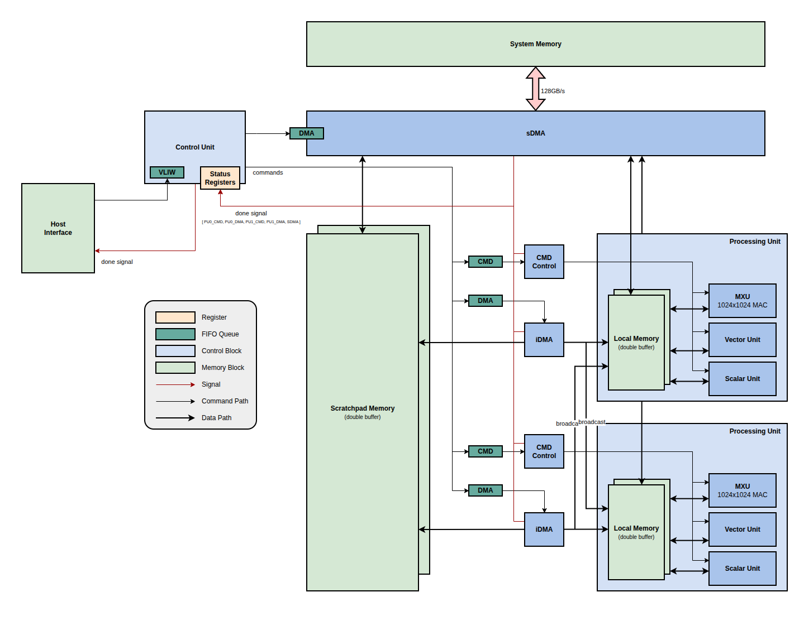

# VLIW TPU Simulator

A behavioral-accurate C++ simulator for a VLIW-based TPU (Tensor Processing Unit). This simulator models the asynchronous execution of commands across multiple engines (sDMA, iDMA, Processing Units) and enforces a software-hardware contract using a bitmask-based scoreboard (Status Register) for synchronization.

## Architecture

The simulator models the following xTPU architecture:



### Core Components

*   **Control Unit & VLIW Dispatch**: The brain of the system. It dispatches Very Long Instruction Word (VLIW) packets containing commands for multiple engines. It handles synchronization by checking the Status Register.
*   **Status Register (Scoreboard)**: A central, atomic bitmask register. Each engine has a dedicated "Busy" bit.
    *   **Set Busy**: The Control Unit sets the bit before dispatching a command.
    *   **Clear Busy**: The Engine clears the bit upon completion.
    *   **Fence / Sync**: The Control Unit waits (`wait_on_mask`) for specific bits to clear before proceeding, implementing the "Completion Path".
*   **Engines**:
    *   **sDMA (System Direct Memory Access)**: Handles data transfers between System Memory (simulated) and the On-Chip Scratchpad.
    *   **iDMA (Internal DMA)**: Moves data between the Scratchpad and Local Memories. Supports **Broadcast** (reading once from Scratchpad and writing to multiple Local Memories simultaneously).
    *   **Processing Units (PU0, PU1)**: Execute compute operations (Matrix Multiply, Vector, Scalar).
*   **Memory Hierarchy**:
    *   **Scratchpad**: Shared, dual-ported on-chip memory (1MB).
    *   **Local Memory**: Private memory for each PU (64KB), implementing **Double Buffering** (Buffer 0 and Buffer 1) to allow overlapping compute and data transfer.

## Environment Setup

### Requirements
*   Linux environment
*   C++ Compiler supporting C++17 (e.g., `g++`)
*   `make`

## Building and Running

1.  **Build the Simulator**:
    ```bash
    make
    ```
    This will compile the source code and generate the `test_simulator` executable.

2.  **Run the Verification Test**:
    ```bash
    ./test_simulator
    ```

    The test runs a predefined scenario to verify the completion path and architecture behavior:
    1.  **sDMA Load**: Load data into Scratchpad.
    2.  **Sync & Broadcast**: Wait for sDMA, then Broadcast data to PU0 and PU1 Local Memories.
    3.  **Parallel Execution**: PUs compute on Buffer 0 while sDMA loads new data for Buffer 1 (Double Buffering).
    4.  **Final Sync**: Wait for all operations to complete.

    **Expected Output**:
    You will see logs of the "Scoreboard" transitions, e.g.:
    ```text
    [Scoreboard] [0b00000] -> [0b00001]  (Set sDMA Busy)
    ...
    [Scoreboard] [0b00001] -> [0b00000]  (sDMA Done)
    ```

## Directory Structure

*   `src/`: Source code.
    *   `simulator.hpp/cpp`: Main simulator logic.
    *   `engines.hpp/cpp`: Engine implementations.
    *   `memory.hpp`: Memory models.
    *   `status_register.hpp`: Synchronization logic.
    *   `commands.hpp`: Command definitions.
*   `tests/`: Unit tests.
    *   `test_simulator.cpp`: Main verification scenario.
*   `docs/`: Documentation and diagrams.
